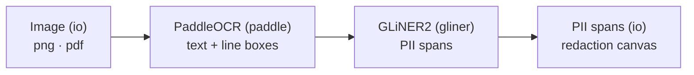
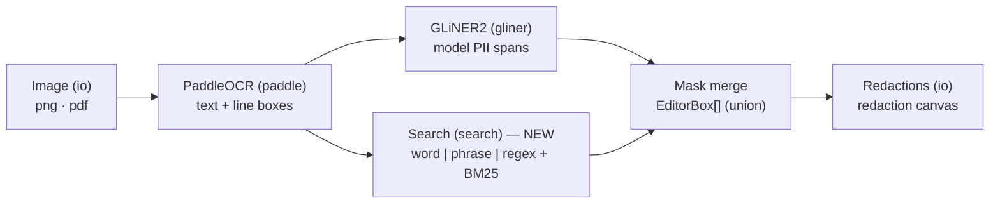
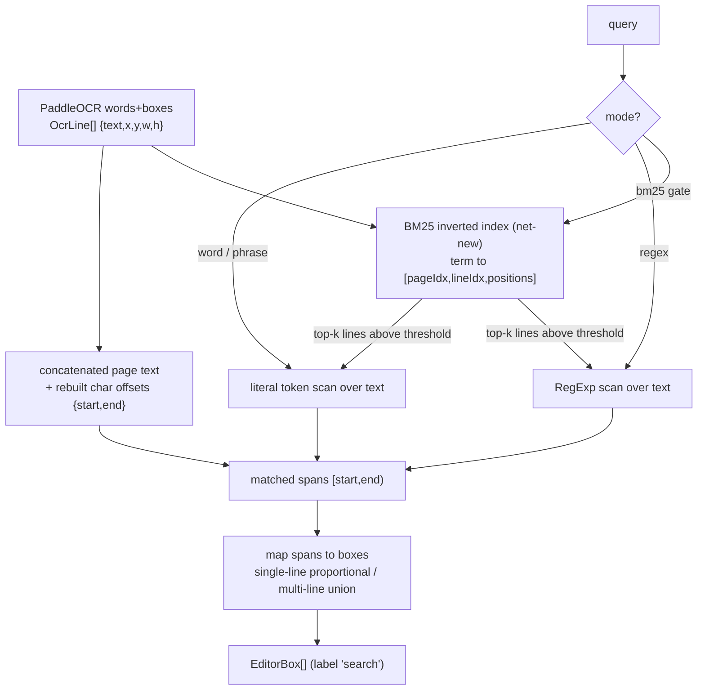
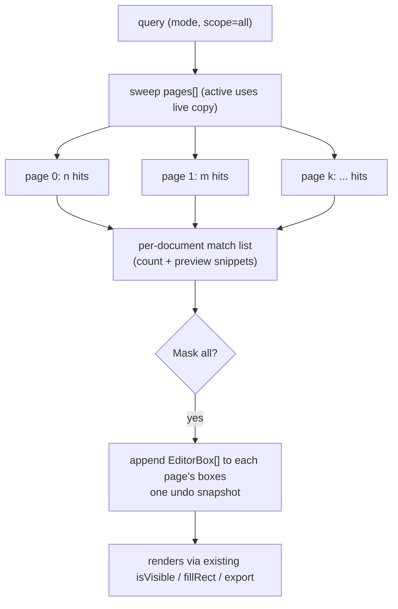
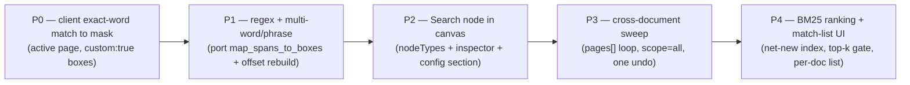

# New features — Search node + search-based direct masking

> Planning doc. **No implementation code** — diagrams, data-shape sketches, trade-offs, open
> questions. Every claim is grounded in the actual repo (paths cited inline). Companion to
> `README.md` and `TODO.md`.

---

## 1. Overview & motivation

Ranymizer today redacts with **one** producer of masks: the model-based PII path
(PaddleOCR → GLiNER2 → `map_spans_to_boxes`). That path is *probabilistic* — GLiNER2 proposes
spans, per-label regex rules only *reject* false positives (`LabelRule.regexMode` is
`full | partial | exclude`, never "find"; `frontend/src/lib/types.ts:115-136`,
`backend/app.py:_apply_post_filter`). A handläggare cannot say "redact **every** occurrence of
this name / case number / phrase across all the pages I just dropped in." The model decides what
gets masked.

These two features add a **deterministic, user-driven** producer that complements (does not
replace) GLiNER:

1. **Search node** — a fourth node in the `@xyflow/svelte` pipeline canvas, alongside
   `PaddleNode` / `GlinerNode` / `IoNode` (`PipelineSketch.svelte:28`,
   `frontend/src/lib/components/pipeline/`). It is the *config + status surface* for the search
   matcher, exactly as `GlinerNode` is for GLiNER2.
2. **Search-based direct masking** — the engine behind the node: take a query (single word,
   multiple words, or a **regex**), match it against the OCR text that already lives in the
   browser after Run, map every hit back to the PaddleOCR **line boxes**, and emit
   `EditorBox`es — the *same mask unit* GLiNER produces (`frontend/src/lib/types.ts:48-52`). BM25
   is layered on top to **rank/gate which documents and lines** to scan across a multi-page
   corpus, not to locate exact words.

The two relate as **surface** (node 1) and **mechanism** (feature 2): the node writes a
`PipelineConfig.search` section; the mechanism reads it and mints masks. Because masks are
label-agnostic about provenance (everything downstream just iterates `EditorBox[]` —
`Canvas.svelte:91-110`, `state.svelte.ts:#renderPageCanvas`, `pageToPngBlob`), search masks get
preview overlay, PNG export, thumbnails, sidebar rows, and undo/redo **for free**.

> Design alignment: the auto-memory preference is "native APIs, simpler chunks-table-only
> architecture, tight scope." The recommendation below is **client-side, no backend change** for
> P0–P2, which is the tightest possible scope and is the *first working box producer on the
> local/Tauri target* (today `worker.ts::spansToBoxes` is a stub returning `[]` —
> see `TODO.md`).

---

## 2. Where it fits in the pipeline

The xyflow graph is a **static config/visualization surface** — it does not run anything;
`editor.run()` (navbar Run / "Apply & Run") drives inference (`SettingsDrawer.svelte`,
`state.svelte.ts:run`). Nodes are hardcoded, `nodesConnectable={false}`
(`PipelineSketch.svelte:130`); the user cannot rewire. So "inserting" the Search node means
adding one `nodeTypes` key, one `nodes[]` entry, and re-authoring `edges[]`.

### Current graph (authored in `PipelineSketch.svelte:33-106`)



### Proposed graph — Search as a parallel deterministic branch off OCR



Both branches consume the **same** PaddleOCR output (`ocr['words']` → `OcrLine[]`,
`frontend/src/lib/types.ts:28-34`) and emit the **same** mask contract (`Box`/`EditorBox`). The
key grounded fact: **search needs no model** — `editor.ocrLines` + `editor.sourceText` (and the
per-page snapshots `pages[i].ocrLines` / `pages[i].sourceText`, `state.svelte.ts:29-41`) already
exist in the browser once OCR has run. The Search branch is pure arithmetic over data already on
the device.

> Layout choice (open question §8): parallel branch off `paddle` (drawn above) reads as "two
> independent redaction sources merging," which matches reality. The alternative — inserting
> `search` *between* `gliner` and `output` in series — implies search depends on GLiNER, which it
> does not. **Recommend the parallel branch.**

---

## 3. The search model

### The hard constraint: OCR is **line-granular**, not word-granular

The single most important fact (`backend/app.py:_extract_page_lines:208-245`): the OCR unit is one
text **line** / region polygon, not a word and not a char. Each line is
`{text, start, end, x, y, w, h}` where `x,y,w,h` are **pixels** in the source image's coordinate
space (top-left origin, no normalization anywhere — OCR boxes, mask boxes, and the displayed image
share one pixel space per page; `server.py:119-121`, `Canvas.svelte:68`). The user's mental model
("where each **word** is located") does not match the data: there is no per-word box.

`start`/`end` are char offsets into the `\n`-joined page text (`app.py:231,243,284`). **These
offsets are the bridge from a text match back to a box** — but they are **stripped on the wire**:
`server.py:_ocr_line_to_debug_overlay:72-73` returns only `{text,x,y,w,h}`, and the frontend
`OcrLine` type has no `start`/`end` (`types.ts:28-34`). This is the central design fork (§6, §8).

### (a) Exact word / multi-word (phrase) matching

A literal substring/token search over the concatenated page text. Multi-word = the same, with the
query tokens joined by `\s+` (whitespace-tolerant) so a phrase that the OCR split across the line
boundary still matches. Knobs: case sensitivity, diacritic folding (Swedish å/ä/ö), whole-word
(`\b`-style) toggle.

### (b) Regex matching → mapping hits back to boxes

A user regex runs over the concatenated text; each match yields `[start, end)`. **A regex match is
exactly a `PiiSpan` with a synthetic label** (`{label:'search', text, start, end, confidence:1}`,
`types.ts:15-21`), so it reuses the GLiNER span→box transform **verbatim**
(`backend/app.py:map_spans_to_boxes:463-476`):

- 1 overlapping line → `_single_line_box` (`app.py:427-445`): proportional x-sub-range within the
  line (uniform-char-width assumption) + `BOX_PADDING_PX=2`. Tight but **approximate**.
- ≥2 overlapping lines (match spans a line break) → `_union_box` (`app.py:448-460`): bounding
  union of all overlapping lines, full line height. Safe, over-redacts.

Overlap test: `_line_overlaps_span` = `not (line.end <= span.start or line.start >= span.end)`
(`app.py:423-424`). This is the answer to "how to map a regex hit that spans multiple OCR words":
collect every line whose `[start,end)` overlaps the match and union them. **This logic is ~40
lines of pure arithmetic — it can be ported client-side**, or the match can mask the whole
overlapping line(s) via a "safe (full line)" toggle.

> A client-side, geometry-free alternative that needs **no** offset rebuild: reuse
> `editor.textInBox(x,y,w,h)` (`state.svelte.ts:777-799`) in reverse — but that goes box→text, not
> text→box. For text→box we need the offsets, so either rebuild them (§6) or port
> `map_spans_to_boxes`.

### (c) BM25's role — rank/gate, **not** locate

BM25 is a relevance **ranker**, not a span locator; it cannot give you `[start,end)`. There is **no
BM25/lunr/minisearch/flexsearch dependency in the repo today** — it is net-new. Its job here is
two-stage retrieval:

1. **BM25 retrieve** — tokenize each line (the box-carrying unit) into terms, build an inverted
   index `term → [{pageIdx, lineIdx, positions}]`, BM25-rank which lines/pages best match a
   multi-term query, keep the top-k above a **BM25 threshold**.
2. **Regex/token redact** — within those ranked lines, run the exact/regex matcher to select the
   precise word boxes.

This makes "search ACROSS DOCUMENTS + bm25 to find/rank documents" coherent: BM25 chooses *where to
look*; regex/exact chooses *what to mask*.

### Matcher contrast

| Matcher | Granularity of query | Produces a maskable span? | When used | Cost |
|---|---|---|---|---|
| **Exact word / phrase** | literal token(s) | yes — substring `[start,end)` → line box(es) | "redact this exact name/number everywhere" | trivial (`indexOf`-style) |
| **Regex** | pattern | yes — match `[start,end)` → line box(es) via `map_spans_to_boxes` semantics | "redact anything matching `\d{6}-\d{4}`" | per-page scan; ReDoS risk (§8) |
| **BM25** | bag of terms | **no** — ranks lines/pages only | "find the docs/regions about X, then mask within them" | net-new inverted index |

Realistic combination: **BM25 (gate top-k lines) → regex/exact (locate words) → line box(es)
(mask)**. BM25 alone never masks.

### Data flow



---

## 4. The Search node

### Node data contract (mirrors `GlinerNode.svelte`)

Like `PaddleNode`/`GlinerNode`, the Search node takes **only** `{ selected }: NodeProps`
(`GlinerNode.svelte:13`) and reads all real state from the global `editor` singleton — `data` stays
`{}`. It renders `<Handle type="target" position={Position.Left}>` + `<Handle type="source"
position={Position.Right}>`, a `StageDot` (`StageDot.svelte`, status
`'idle' | 'active' | 'done'`), a compact summary (current query + mode chips + match count), and the
single most important knob inline (the query input). **Every interactive control must carry the
`nodrag` class** (`GlinerNode.svelte:73`) or dragging the control pans the node.

```ts
// SearchNode receives only { selected }; reads editor.pipelineConfig.search
// Node entry added to PipelineSketch.svelte nodes[] (mirrors :44-52):
{ id: 'search', type: 'search', position: { x: 480, y: 220 },
  data: {}, sourcePosition: Position.Right, targetPosition: Position.Left,
  deletable: false, draggable: true }
```

### Config panel (`PipelineConfig.search` — new section)

The node body shows a summary; the **full form** lives in `PipelineInspector.svelte` as a new
`{:else if selectedId === 'search'}` branch in the big switch (paddle/gliner branches at
`PipelineInspector.svelte:235/316`, fallback "No settings for this node" at `:705`). Form fields:

| Field | Type | Notes |
|---|---|---|
| `query` | `string` | the search term / phrase / pattern |
| `mode` | `'word' \| 'phrase' \| 'regex'` | matcher selector |
| `caseSensitive` | `boolean` | default off |
| `diacriticSensitive` | `boolean` | Swedish å/ä/ö folding when off |
| `wholeWord` | `boolean` | `\b` boundaries (word/phrase modes) |
| `boxMode` | `'tight' \| 'line'` | proportional sub-range vs full overlapping line(s) |
| `useBm25` | `boolean` | gate scan to top-k ranked lines |
| `bm25Threshold` | `number` (0..1 or score) | minimum BM25 relevance to include a line |
| `scope` | `'all' \| 'page'` | cross-document vs active page (mirrors `TextSidebar` scope, `TextSidebar.svelte:24`) |

Plus a **live match-count / preview** (search has no model, so it can re-run reactively as the user
types — see §8 on whether it joins the SSE timeline at all).

### Registration (4 edit sites, grounded)

1. `PipelineSketch.svelte:28` — add `search: SearchNode` to `nodeTypes`.
2. `PipelineSketch.svelte:33-72` — add the `search` node entry; re-author `edges[]` (`:81-106`) to
   add `paddle → search` and `search → output` (parallel branch).
3. `PipelineSketch.svelte:110-119` — if search is on the SSE timeline, animate its edge from a new
   `editor.pipelineStage` value.
4. `PipelineInspector.svelte` — add the `{:else if selectedId === 'search'}` branch.
5. `SearchNode.svelte` (new) under `frontend/src/lib/components/pipeline/`.

Config persistence mirrors GLiNER exactly: add `search` to `PipelineConfig` (`types.ts:63`) +
`DEFAULT_PIPELINE_CONFIG` (`types.ts:263`) + the valibot `PipelineConfigSchema`
(`pipelineConfig.schema.ts:55-59`). The pydantic mirror (`backend/schema.py:53-58`, `extra="ignore"`,
lenient) is **only** needed if search runs server-side (it should not — §5). Every edit calls
`editor.persistPipelineConfig()` (writes localStorage `ranymizer:pipeline-config`); an invalid blob
is discarded wholesale by `tryValidate` (`pipelineConfig.schema.ts:73`).

### How search masks merge with GLiNER masks

There is no merge *step* — both append `EditorBox[]` to `editor.boxes` / `pages[i].boxes`, and the
renderer unions them implicitly (`Canvas.svelte:91-110` iterates all boxes; `isVisible`,
`state.svelte.ts:311-315`). Two grounded labeling choices:

- **`custom: true`** (like hand-drawn boxes, `addCustomBox`, `state.svelte.ts:801-824`): always
  visible, **bypasses the category filter**, and **survives re-Run** (run() preserves custom boxes,
  `state.svelte.ts:479`). Simplest, but indistinguishable from hand-drawn boxes in the sidebar.
- **Dedicated `'search'` label** registered in `editor.activeCats` with a `catMeta` color entry
  (`state.svelte.ts:144-150`): reads as a distinct redaction class, filterable, but must be seeded
  into `activeCats` or it paints nothing (`isVisible:313`), and won't survive re-Run unless the
  search re-applies.

> Recommend a dedicated `search` label + `catMeta` color, set `custom:true` *as well* so it both
> reads distinctly **and** survives re-Run / bypasses the filter. (Validate that `custom:true` +
> a real label behaves — `addCustomBox` sets `custom:true` and only adds the label to `activeCats`
> when `label !== 'custom'`, so the pattern already supports this.)

---

## 5. Cross-document search

### The actual multi-doc model (grounded)

Ranymizer is **already fully multi-document/multi-page**. "Documents" = `editor.pages: Page[]`
(`state.svelte.ts:167`); PDFs rasterize to one `Page` per page (`pdfToImageFiles` in `uploadFiles`,
`state.svelte.ts:345`). Each `Page` carries its own `sourceText`, `ocrLines`, `boxes`
(`state.svelte.ts:29-41`). Cross-page machinery already exists:

- `allBoxes` (`state.svelte.ts:296-303`) — every box across every page, paired with `pageIdx`,
  reading `i === activeIdx ? this.boxes : pages[i].boxes`.
- `run()` (`state.svelte.ts:466-540`) already **loops over all pages**, calling
  `engine.analyze(page.file, ...)` per page and preserving custom boxes.
- `TextSidebar.svelte` already has an `'all' | 'page'` **scope toggle** (`:24`) and a substring
  `query` filter over all boxes (`:124-137`). **This is UI precedent, but it filters
  already-produced boxes — it is NOT a masking search.** The new Search node *creates* masks from
  raw OCR; the sidebar search *filters* existing ones. Distinct features.

### The one real gap

Only the **active** page's `ocrLines`/`sourceText` are populated as live working copies
(`state.svelte.ts:107-114`); other pages keep snapshots in `pages[i].*`. A cross-doc search must
read `i === activeIdx ? this.ocrLines/this.sourceText : pages[i].ocrLines/pages[i].sourceText` —
exactly the split `allBoxes` already uses. Also: **search is only meaningful after Run** (OCR
populates `ocrLines`/`sourceText`).

### UX: list matches per document, mask all occurrences



### Client-side vs backend — **recommend client-side**

| Dimension | Client-side (recommended) | Backend endpoint |
|---|---|---|
| Data needed | already in browser (`pages[i].ocrLines/sourceText`) | would re-derive what the client holds |
| Privacy | nothing leaves the device — matches the on-device ethos (`engine/types.ts:24` "True when nothing leaves the device") | re-uploads images |
| Local/Tauri target | works (no model needed) — first working box producer there | the local engine doesn't even plumb `PipelineConfig` yet (`local.ts` TODO) |
| Cross-session corpus | no (in-session only) | yes (persistent index) |
| Scope/effort | tight; no new route, no pydantic mirror | new `gr.Server` route paralleling `anonymize_screenshot` (`server.py:76`) |

The backend SSE endpoint takes a **single image** (`server.py:77`) and `run()` loops one page at a
time — **cross-document BM25 does not fit the current per-image SSE shape**, which would force an
architectural change. Client-side sidesteps this entirely and aligns with the memory preference for
tight scope / native APIs. **Recommend client-side for P0–P3.** A backend index is justified *only*
for a persistent cross-session corpus (out of scope; would be the LanceDB chunks table referenced in
the memory/TODO, not needed for "search the docs I just OCR'd").

---

## 6. Data shapes

### Existing (reused, not changed)

```ts
// frontend/src/lib/types.ts:28-34 — the boxes a search reuses (LINE-level, pixel coords)
type OcrLine = { text: string; x: number; y: number; w: number; h: number };
// backend internal carries start/end too; STRIPPED on the wire (server.py:72-73)

// frontend/src/lib/types.ts:6-13 — wire mask shape
type Box = { label: string; text: string; x: number; y: number; w: number; h: number };

// frontend/src/lib/types.ts:48-52 — the rendered/sidebar/export/undo unit (what search emits)
type EditorBox = Box & { id: number; enabled: boolean; custom: boolean };

// frontend/src/lib/types.ts:15-21 — a regex/exact hit IS one of these (synthetic label)
type PiiSpan = { label: string; text: string; start: number; end: number; confidence: number };
```

### New — search config (extends `PipelineConfig`, `types.ts:63`)

```ts
// added to PipelineConfig + DEFAULT_PIPELINE_CONFIG (types.ts:263)
//        + valibot PipelineConfigSchema (pipelineConfig.schema.ts:55)
//        + (only if server-side) pydantic schema.py:53
search: {
  query: string;
  mode: 'word' | 'phrase' | 'regex';
  caseSensitive: boolean;
  diacriticSensitive: boolean;
  wholeWord: boolean;
  boxMode: 'tight' | 'line';   // proportional sub-range vs full overlapping line(s)
  useBm25: boolean;
  bm25Threshold: number;
  scope: 'all' | 'page';
};
```

### New — search result + BM25 index (net-new client structures, no file extended)

```ts
// per-page match before box mapping
type SearchMatch = { pageIdx: number; start: number; end: number; text: string };
// per-document rollup for the match list UI
type SearchPageResult = { pageIdx: number; filename: string; matches: SearchMatch[] };
// BM25 index — net-new, no equivalent in repo (grep found nothing)
type Bm25Index = {
  // line is the box-carrying unit, so index per line
  postings: Map<string, Array<{ pageIdx: number; lineIdx: number; positions: number[] }>>;
  lineBox: Map<string /* `${pageIdx}:${lineIdx}` */, OcrLine>;
};
```

### Wire-change prerequisite for client regex (the design fork)

To map text positions → boxes, the per-line `start`/`end` offsets are required. Two options:

- **Option A (cleaner, one-field wire change):** add `start`/`end` back to
  `server.py:_ocr_line_to_debug_overlay:72-73`, the `OcrLine` type (`types.ts:28`), and the
  `ocr_done`/`done` frames. Benefits any future client masking.
- **Option B (no backend touch):** rebuild offsets client-side by re-running app.py's `\n`-join
  arithmetic over `ocrLines` (accumulate `len(line.text)+1`, `app.py:231,243,284`). Keeps the
  client-only ethos, costs a small duplication of logic.

> Recommend **B for P0–P2** (zero backend coupling, matches tight-scope preference); revisit A if a
> future feature also needs offsets.

---

## 7. Build plan



| Phase | Deliverable | Touches | Notes |
|---|---|---|---|
| **P0** | Exact-word match → mask on the active page | `state.svelte.ts` new method (reuse `addCustomBox`/`textInBox` pattern, `:801`/`:777`) | Smallest vertical slice; proves the render path with `custom:true`. No node yet — a temp button/effect. |
| **P1** | Regex + phrase; multi-line union | port `map_spans_to_boxes`/`_single_line_box`/`_union_box` (`app.py:427-476`); rebuild offsets (§6 Opt B); `boxMode` toggle | ReDoS guard + invalid-pattern error UX (see `addError` pattern in `PipelineInspector`). |
| **P2** | The Search node + persisted config | `PipelineSketch.svelte:28/33/81`, `PipelineInspector.svelte:235+`, `SearchNode.svelte`, `types.ts:63/263`, `pipelineConfig.schema.ts:55` | Config persists like GLiNER; live match-count in node body. |
| **P3** | Cross-document masking | `state.svelte.ts` sweep over `pages[]` (mirror `allBoxes:296-303`); `scope='all'`; one `#snapshotForUndo` | Active-page live-copy split; only post-Run. |
| **P4** | BM25 ranking + per-doc match list | net-new client inverted index; `useBm25`/`bm25Threshold`; match-list UI | BM25 gates top-k lines → regex locates words. Distinguish search boxes via `catMeta` color. |

---

## 8. Open questions / decisions

1. **Regex ↔ BM25 boundary.** "bm25 mask text" is ambiguous: does BM25 (a) rank pages/lines for the
   user to review top-k *before* masking, or (b) silently gate which lines regex scans? BM25 cannot
   locate spans — confirm it is **retrieve-then-redact** (BM25 top-k → regex/exact within). *Leaning
   (a) review-then-mask for a deterministic redactor; surface ranked candidates, user confirms.*
2. **Client vs backend.** Recommended client-side (§5). Backend only for a persistent cross-session
   corpus index — out of current scope, and the SSE endpoint's single-image shape (`server.py:77`)
   plus the per-page `run()` loop don't fit cross-doc BM25 without a new route.
3. **Multi-word match spanning lines / pages.** Within a page, line break = union of overlapping
   lines (`_union_box`). Across **pages**, a phrase cannot span a page boundary (separate images,
   separate coord spaces) — confirm we never try to. Whitespace-tolerant token join (`\s+`) handles
   OCR line wraps inside a page.
4. **Word vs line precision (coordinate concern).** Boxes are line-granular; word-narrowing is a
   *proportional uniform-char-width approximation* (`app.py:436-437`) — single-word masks in a long
   line are approximately placed, not glyph-tight. Offer `boxMode: 'tight' | 'line'`; default to
   **`'line'` (safe over-redaction)** for a redaction-correctness guarantee. No normalization issues
   — everything is one pixel space per page (`server.py:119-121`).
5. **Offset availability.** Client rebuild (Opt B) vs wire change (Opt A) — §6. Recommend B for now.
6. **Labeling / undo.** `custom:true` (always visible, survives re-Run, indistinguishable in
   sidebar) vs a dedicated `'search'` label (distinct, filterable, must seed `activeCats`, won't
   survive re-Run). Recommend **dedicated label + `custom:true` together** (§4). Undo: one
   `#snapshotForUndo` (`state.svelte.ts:195-203`) per "mask all," not per box.
7. **Lifecycle.** Does search run inside `run()` as a post-OCR stage (joins the SSE
   `pipelineStage` timeline, `state.svelte.ts:100`, animates an edge), or as an **independent,
   instant, reactive** action (re-runs as the user types, never on the SSE timeline)? Search needs
   no model, so the reactive path is natural and cheaper. *Recommend reactive/on-demand; keep it off
   the SSE stage timeline, optionally add a synthetic 'search' StageDot state for the node.*
8. **Graph layout.** Parallel branch off `paddle` (recommended, models two independent sources) vs
   series after `gliner` (implies a false dependency). §2.
9. **Regex safety.** User regex runs over full-document text across all pages — needs ReDoS
   guarding / timeout and explicit invalid-pattern feedback. The GLiNER post-filter silently
   swallows bad regex (`app.py:341-347` try/except); a *user-facing* search must surface errors
   like the custom-label `addError` pattern in `PipelineInspector`.
10. **Performance on large docs.** Concatenated-text regex + offset rebuild is O(text) per page;
    fine for screenshots, watch many-page PDFs. BM25 index build is O(tokens) — build lazily/once
    per OCR result, invalidate on Run. Mask-all on a huge corpus → batch into one undo snapshot and
    consider a progress indicator (mirror `run()`'s `#uploadId` cancellation pattern,
    `state.svelte.ts:346`).

### Flagged as not determinable from the survey/repo

- **BM25 exact intent** (rank-and-review vs silent gate) — needs a product decision; not encoded
  anywhere in the repo.
- **No existing search/index library** — BM25 is genuinely net-new (grep for
  bm25/lunr/minisearch/flexsearch/tantivy/whoosh found nothing; only hits are the `TextSidebar`
  substring filter and GLiNER regex post-filters).
- Whether the **local/worker engine** should plumb `PipelineConfig` for search — moot if search is
  client-side (it reads `editor.*` directly, not the engine), but flagged because `local.ts`/`worker.ts`
  config plumbing is still a TODO.
